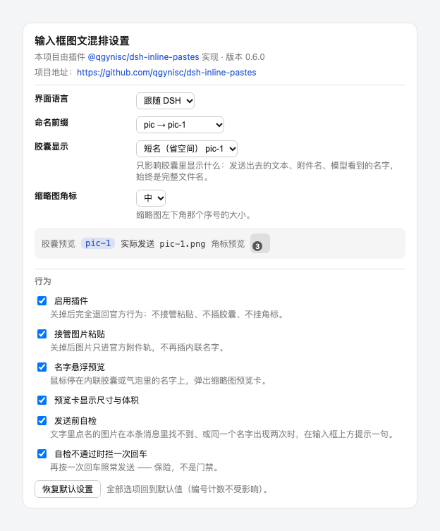

# dsh-inline-pastes

[](https://www.npmjs.com/package/@qgynisc/dsh-inline-pastes)
[](https://github.com/qgynisc/dsh-inline-pastes/actions/workflows/test.yml)
[](https://github.com/qgynisc/dsh-inline-pastes/blob/main/LICENSE)
[](https://github.com/qgynisc/dsh-inline-pastes/releases)

**English** | [简体中文](README.md)

Adds four things to **DeepSeek Harness Desktop (built-in Web GUI)**:

1. **Images referenced inside your text** — when you paste an image, an inline chip `[icon] pic-1` is inserted **at the caret**. The image itself still goes out with the message as an attachment through the official pipeline (the model receives it exactly as before).
2. **Hover preview** — park the pointer on **that name** (the inline chip in the composer, or the same text in an already-sent bubble) and a thumbnail preview card pops up with dimensions and file size. Move away to dismiss; `Esc` also dismisses.
3. **Automatic numbering** — names are generated as `pic-1.png`, `pic-2.png`, … The prefix follows the media class and the extension follows the real MIME type, leaving room for future types such as mp3 and pdf.
4. **A settings page** — *Settings → Mixed layout* controls everything in one place: name prefix, short vs. full chip label, three thumbnail-badge sizes, interface language (follow DSH / 中文 / English), plus the master switch, paste takeover, hover preview and the pre-send audit. Changes take effect **immediately**.

## Installation

> The client half only uses the Web client APIs (`conversation` / `sessions` / `uiSession` / `inputTriggers`) plus the DOM.
> It does not depend on any desktop-only bridge (such as `__DSH_HOST_PATHS__` injected by the Electron preload),
> so it works under **both DSH Desktop and `dsh web` (browser)**.

**Option 1: clone locally and use the bundled scripts (tested on a real machine)**

```bash
git clone git@github.com:qgynisc/dsh-inline-pastes.git
cd dsh-inline-pastes
npm run build                # optional: lib/ is committed, and the build output is exactly what the loader needs
npm run install:desktop      # install into the desktop profile (backs up package.json / pnpm-lock.yaml automatically)
# another profile: node scripts/install.mjs --profile web
```

After installing, **restart DeepSeek Harness** (client plugins only take effect after their bundle is reloaded).

**Option 2: use the DSH plugin install command**

```bash
dsh plugin --profile desktop add git@github.com:qgynisc/dsh-inline-pastes.git
```

**Uninstall**: `npm run uninstall:desktop`, or simply delete the `@qgynisc/dsh-inline-pastes` line from
`dsh.profile.bundles` in the profile and its matching entry under `dependencies`.

**Verify it loaded**: after restarting, `__dshInlinePastes.version` in the browser console should equal the plugin version.

## What it looks like

**① Images referenced inside text** — paste an image, the chip lands at the caret, and the image is still sent as an attachment with the message:


<sub>(The dark overlay near the top of that screenshot is a macOS file tooltip; it has nothing to do with this plugin.
These screenshots were taken when the default prefix was still `image`, and before the chip got its short alias —
the current default is `pic`, and the chip shows `pic-1`; see the settings section.)</sub>

**② Hover preview** — park the pointer on the name inside the chip and a preview card pops up (thumbnail + name + dimensions · size); it closes as soon as you move away:


---

```
1、功能1  [🖼 pic-1]
2、功能2  [🖼 pic-2]
3、修改bug如图：[🖼 pic-3]，把它变成可自动定位。
```

---

## The settings page: Settings → Mixed layout

After installing, restart DeepSeek Harness and Settings gains a **Mixed layout** entry (Chinese UI: **混合排版**).



<sub>(Preview render; the panel follows the DSH interface language.)</sub>

| Row | Default | Notes |
| --- | --- | --- |
| Language | Follow DSH | Follows DSH's interface language (the `locale` service), or force 中文 / English — the panel copy *and* the nav label follow |
| Name prefix | `pic` | `pic` / `image`, or a custom prefix (`A-Za-z0-9_-`, starting with a letter or digit) |
| Chip label | Short `pic-1` | Or the full name `pic-1.png`; **display only** (next section) |
| Thumbnail badge | Medium | Off / Small (12px) / Medium (14px) / Large (18px) |
| Enable plugin | On | Turning it off falls back completely to the official behavior |
| Intercept image pastes | On | Off = images only go to the official attachment track |
| Hover preview | On | Master switch for the preview card |
| Show dimensions & size | On | |
| Pre-send audit | On | |
| Hold the first Enter on audit failure | On | Off = warn only |
| Restore defaults | — | Back to factory defaults (sequence counters untouched) |

- Settings are stored **per device in localStorage** (`dsh-inline-pastes:settings:v1`) — not synced across sessions or accounts; clearing site data restores the defaults.
- Changes apply **immediately**: badges resize or disappear at once, and the next pasted image uses the new name. The master switch is immediate in both directions too (while it is off the settings page stays available, so you can always switch it back on).
- If React / `slots` / `locale` are unavailable (a very old DSH, or a non-Web client), the settings page simply does not appear — pasting, chips, previews and badges keep working.

### The short chip label is a display alias

With the default `short` chip label the chip reads `pic-1`, but at **send time** the same reference is re-serialized by the codec into the full file name `pic-1.png`:

| Where | What you see |
| --- | --- |
| The chip in the composer | `pic-1` (short, saves space) |
| The text that is sent / the sent bubble | `pic-1.png` |
| The attachment name / the model-side handle line | `pic-1.png` |

**The model-side pairing is unaffected** (both the text and the handle line say `pic-1.png`). The trade-off: you see the short name while writing, and the full name in the bubble after sending — pick *Chip label → Full file name* if you want them identical.

Hover preview understands both spellings: hovering the short name in the composer and the full name in a bubble both open the same image.

## With multiple images, how names and images stay paired (no mix-ups)

**The model side works by "reading the name attached to the image", not by counting order.** When DSH sends images to a model it inserts a line of text
**immediately before each image** (`requestImageHandleText` in `@deepseek-ai/dsh-llm`; both the DeepSeek and pi-ai adapters go through it):

```
Image "pic-1.png" (sha256:abc…); request preview 1972x397px. …
<the image itself>
Image "pic-2.png" (sha256:def…); request preview 1200x800px. …
<the image itself>
```

So when the model reads `pic-1.png` in your text, the image right next to it carries the very same name — one-to-one.
Even if images dragged in or added with the `+` button are mixed in (they keep their own original file names, also with a handle line), nothing gets crossed.

**On the UI side**: DSH lays out all images of a message in an attachment row **above** the bubble, with the text inside the bubble — so what a human sees is
"a row of thumbnails on top, names in the text below", aligned by name (thumbnails themselves show no name, only an accessible label on hover).

**Three guarantees this plugin makes**:

1. Within one message: **paste order = numbering order = attachment order** (pasting several at once also follows clipboard order);
2. If you delete a chip from the text but leave the dock thumbnail in place, **numbering does not restart** (otherwise one message would contain two `pic-1`s);
3. Numbering restarts from `pic-1` only after sending (when both the draft and the attachments are cleared).

**Two caveats that remain**:

- If you **delete one thumbnail in the middle** of the dock before sending while leaving its chip in the text, that message's numbering will be off by one against the image count.
  Either delete the chip together with the thumbnail, or glance over it before sending;
- Numbering restarts per message (which is the intent), so **the same name `pic-1.png` appears in different messages**. Within one message there is no ambiguity
  (the handle line sits right next to the image), but names are not unique if you reference them across messages. If you want per-session uniqueness, set `CONFIG.counterScope` back to `'session'`.

## Naming rules

| Pasted content | Generated name |
| --- | --- |
| PNG screenshot | `pic-1.png`, `pic-2.png` … |
| WebP / JPEG / GIF | `pic-1.webp` / `pic-1.jpg` / `pic-1.gif` |
| MP3 / WAV | `audio-1.mp3` / `audio-1.wav` |
| MP4 / MOV | `video-1.mp4` |
| PDF | `pdf-1.pdf` |
| docx / xlsx / pptx | `doc-1.docx` |
| txt / md / json | `text-1.md` |
| zip / tar / 7z | `zip-1.zip` |
| Anything else | `file-1.<real extension>` |

- Sequence numbers **count separately per prefix** (`pic-1` and `audio-1` are independent).
- **Every message starts over at `pic-1.png`**; consecutive pastes within the same message continue the sequence (`pic-1` → `pic-2` → `pic-3`).
  The criterion is "the current draft contains no chip from this plugin yet", so **typing first and then pasting an image** (non-empty draft) also counts as a new message; after sending, the draft is cleared and the next message naturally starts at 1 again.
- To switch to "continuous numbering across the whole session": set `CONFIG.counterScope` to `'session'` in `src/client.js` and run `npm run build`.
- Counters **persist in localStorage** (one key per session id, keeping the most recent 100 sessions), so after a page refresh or an app restart, **the same unsent message** keeps counting upward instead of sending `pic-1.png` twice.
- v1 only takes over **image** pastes (`image/png|jpeg|webp|gif`). The naming machinery for audio/documents is already in place; enabling it only requires allowing the corresponding MIME type in `handlePaste`.

## Configuration

**Preferred way: Settings → Mixed layout** (see the settings section above) — changes apply immediately and are stored per device in localStorage.
**Code defaults** live in the `DEFAULTS` object at the top of `src/client.js` (run `npm run build` after changing them): use it for options the settings page does not expose, or to change the factory defaults.

| Key | Default | On the page | Description |
| --- | --- | --- | --- |
| `enabled` | `true` | ✅ | Master switch |
| `interceptPaste` | `true` | ✅ | Turn it off to fall back to the official behavior (images go to the attachment track only) |
| `hoverPreview` | `true` | ✅ | Master switch for the hover preview card |
| `startIndex` | `1` | — | First sequence number |
| `counterScope` | `'message'` | — | `'message'` restarts per message / `'session'` counts across the whole session |
| `hoverDelayMs` | `140` | — | How long the pointer must rest before the preview appears |
| `prefixes` | `{ image: 'pic', … }` | ✅ (image) | Prefix per media class |
| `chipDisplay` | `'short'` | ✅ | Chip shows the short name `pic-1` or the full name `pic-1.png` |
| `badgeSize` | `'md'` | ✅ | Thumbnail badge size: `off` / `sm` / `md` / `lg` |
| `badgeScanMinIntervalMs` | `80` | — | Minimum interval between badge re-scans (the MutationObserver is noisy during streaming, so it is throttled) |
| `maxRemembered` | `600` | — | Preview memory cap (oldest entries are evicted and their object URLs released) |
| `showMeta` | `true` | ✅ | Whether the preview card shows "width×height · size" |
| `auditBeforeSend` | `true` | ✅ | Pre-send audit: warn above the composer when names and images do not line up |
| `blockOnAuditFailure` | `true` | ✅ | When the audit fails, the first Enter press is held back (a second press sends anyway); `false` = warn only |
| `lang` | `'auto'` | ✅ | Language of this plugin's own copy: `auto` follows DSH / `zh` / `en` |

Settings live in localStorage under `dsh-inline-pastes:settings:v1` (separate from the sequence counters, so *Restore defaults* never clears numbering).
The console can drive them too: `__dshInlinePastes.setSettings({ badgeSize: 'lg' })` and `__dshInlinePastes.resetSettings()`.
## Chips must register a codec (a real bug fixed in v0.3.1)

At **send time** the official code does not read the text cached on the node; it re-serializes from "chip source → codec":
`sinkSerialized` in `ui-conversation` calls `inputTriggers.serializeReference(source, ref)` for every reference, and if the owner is missing or has no `codec`
the whole thing is rejected, the draft is thrown back, and you get:

```
slash: no serializer for reference source "inline-paste"
```

So this plugin registers a **codec-only source** with `ctx.inputTriggers.registerSource({ trigger, name: 'inline-paste', codec })`:
the trigger is the untypeable `\u0000inline-paste` (the core trigger detection is hard-coded to `@` and `/`, so it can never show up in any menu), and
`codec.serialize(ref)` turns the hidden ref (`dsh-inline-paste:<file name>`) back into the file name.
When `inputTriggers` is unavailable, the plugin **falls back to plain-text insertion**: losing a chip is better than blocking the send.

## Sequence badges on thumbnails

On the attachment track in the `dock` and on **the image row of already-sent bubbles**, every thumbnail gets a small numbered dot in its lower-left corner
(`pic-3.png` → `3`), and hovering a thumbnail still shows the full name (the native `title`). Even while viewing a full-size image you can tell at a glance
"which one this is".

**Sizes are configurable**: the settings page offers **Off / Small (12px) / Medium (14px, default) / Large (18px)**, applied immediately
(the page shows a live sample). A size only swaps a CSS class (`.dsh-ip-badge--sm|md|lg`) — no node is re-mounted.

**The number is "read", not counted**: the official code fills both thumbnail `alt` attributes with the file name
(the dock uses `attachment.file.name`; bubbles use the `name` of the persistent attachment ref — the same source as the line
`Image "pic-1.png" …` sent to the model), so even if you deleted one of the images or the order changed, the badge never goes out of sync.

**How it is implemented, and the price (the only DOM injection in the plugin)**: the official `conversation.input.attachments` declaration has
`kind: "single"`, and `slots.register` throws if a second registration arrives; taking it over would mean replacing it and rewriting the whole
attachment track (thumbnails / delete / drag / full-size view / upload progress), which is not worth it. So the badge node is appended **inside** the thumbnail's
`<button>` (`overflow:hidden`, lower-left corner, away from the delete `×` in the upper-right), and a
`MutationObserver` **heals it**: if a React re-render wipes it out, it is re-attached automatically.

This is the plugin's only case of inserting a node into React-managed DOM. When it breaks, the symptom is merely **a missing badge** — pasting,
chips, sending and previews are unaffected; switch it off with *Settings → Mixed layout → Thumbnail badge → Off*.

## Pre-send audit (a safety net)

**When it warns**: when one of the following two "mismatches" appears in the current message's draft, a notice is shown above the composer
(through the official composer's notice slot, `shell.notify('info', …)`, without injecting nodes into React-managed DOM):

- The text names an image that is **not present in this message** (for example you deleted the dock thumbnail but kept the chip in the text)
  → `图片名自检：pic-1.png 在本条消息里找不到对应图片（再按一次回车仍可发送）`
- The same name appears **twice** in this message

**How firm the block is**: when the audit fails, **the first Enter press is held back** (with the notice already shown above the composer),
and **a second Enter press sends as usual** — this is a safety net, not a gate. It never silently edits your content and never traps you.
A passing audit, `Shift+Enter` for a newline, an active IME composition, Alt/AltGraph, or focus outside the composer — none of these are touched.

**What it checks and what it does not**: only "does every name mentioned in the text really have an image, and is it unique".
The official pipeline attaches the name to the image itself when sending to a model (see the previous section), so "an image exists but the text does not name it"
is not an error; that image is still sent with its name, and no warning is raised.

To turn it off: `CONFIG.auditBeforeSend = false` (removes the notice too), or `CONFIG.blockOnAuditFailure = false` (warn only, never block).

## Where paste interception stops (the discipline this plugin cares about most)

It takes over only when **all** of the following hold; otherwise it hands everything back to the official `intakeFiles` untouched:

- the event happens inside the composer (detected via the `[data-input-scroll]` marker);
- the clipboard files are **all** image types the official code supports (one pdf mixed in releases the whole batch);
- there is an open, retained session (`uiSession.current`);
- the composer is in the `plain` / `claimed` phase (nothing is done while submitting or resolving);
- the session's `imageLimits` are not exceeded (if they are, the official code shows its own warning).

If anything fails after taking over (even if not a single chip was inserted), it **releases the draft and returns false**, and never calls `preventDefault`.
The previous generation of similar plugins (`@qithird/dsh-paste-input-plus`) blindly intercepted paste in the window capture phase, and because since
DSH 0.2.0-rc.2 the `sessions.list` snapshot no longer carries a `current` field it could not find the session — the result was no chip inserted
*and* all official image pasting blocked. This plugin therefore:

- reads the current session only from `uiSession.current.getSnapshot()` (older snapshot fields are used only as a fallback);
- wraps all of `handlePaste` in try/catch, so the interceptor **lets the event through** when it throws.

## Project layout

```
src/host.js       host half (a placeholder: only there so dsh-client-modules can find the client bundle by package name)
src/client.js     browser half (settings store / name planning / paste takeover / chip insertion / hover preview / badges)
src/panel.js      settings page (React panel + zh/en dictionary + settings.section registration; inlined into client.js at build time)
src/styles.css    preview card + badge + settings page styles (injected into the client bundle at build time)
scripts/build.mjs           wraps things into the window.__ModuleLoader__.load({ id, factory }) artifact (does both anchor replacements)
scripts/verify-browser.mjs  real-Chrome end-to-end verification (static server + harness receipts)
scripts/preview-settings.mjs offline settings-page preview (headless-Chrome screenshot → docs/settings.png)
scripts/install.mjs         installs into / uninstalls from a DSH profile (backs up package.json / pnpm-lock.yaml automatically)
tests/unit/*.test.mjs       unit tests (they test the build artifact itself)
tests/harness/*             browser harness (fake ctx + real ClipboardEvent / elementFromPoint)
tests/helpers/react-shim.js a tiny React stand-in (so the settings component can render to a tree in tests)
```

## Development

```bash
npm run build          # → lib/index.js, lib/client.js
npm test               # build + unit tests + real-Chrome end-to-end (needs Chrome on the machine)
npm run test:ci        # what CI runs: build + unit tests + loader resolution self-check with a temporary profile
npm run verify:browser # browser layer only (needs local Chrome; use --chrome <path> to point at one)
npm run preview:settings # offline settings-page preview → docs/settings.png (no DSH install, no restart)
node scripts/verify-install.mjs --simulate   # on a clean machine/CI with no real profile, create a temporary one and self-check
npm run install:desktop   # install into the desktop profile (the one the desktop app currently uses)
npm run uninstall:desktop # uninstall
```

The build artifact has the same shape as the official client packages (`window.__ModuleLoader__.load({ id, factory })`);
**the id must equal the `name` in package.json**, otherwise dsh-client-modules reports "loaded without registering".

About `require`: the build script **allows exactly `require('react')`** (the settings page needs it). React belongs to the shell's frozen
baseline module table `PLATFORM_MODULES` (the official `dsh-client-modules` docs put it as *the shell seeds a frozen module table — React,
Cordis, and static UI libraries*), so it needs no `dsh.client.external` entry; any other module request is still rejected at build time.
When React is unavailable, the settings page is skipped entirely and nothing else is affected.

## Names repeat, so why previews stay accurate (since v0.3)

Once numbering restarts per message, the same session contains several messages all named `pic-1.png`. Hover previews therefore
**prefer to fetch the image from that message's own attachment row** by index (the Nth `img` in `[data-chat-node-key]` → `[data-message-attachments]`) rather than consulting a global name table:

- every message previews its own image instead of jumping to the newest message;
- this also solves most of the v1 limitation "historical messages have no preview after a refresh" — it uses the session-authorized persistent image URL, so the preview works as long as that image is already rendered in the bubble.

Only names in the composer draft (not yet sent, with no message DOM to rely on) fall back to this plugin's in-memory registry.

## Continuous integration

`.github/workflows/test.yml` runs **Ubuntu × Node 20/22/24** on every push / PR, executing
`npm run test:ci` (build → unit tests → loader resolution self-check with a temporary profile).

It specifically watches two classes of problems **that a local machine cannot catch**:

- **Cross-platform**: the macOS file system is case-insensitive while Ubuntu's is not — a wrongly-cased import path only blows up on Linux;
- **Cross-Node-version**: `package.json` declares `engines >= 20`, while the development machine has only ever run Node 26.

(It cannot catch "a DSH upgrade broke the official contract" — the unit tests use a fake ctx, not a real DSH; that class of breakage can only be caught by testing against the real app.)

## Known limitations

- **The short name in the composer differs from the full name in the bubble** (the default): the chip reads `pic-1`, and the sent bubble reads `pic-1.png`.
  That is the price of the display-alias design and the model side is unaffected; pick *Chip label → Full file name* to make both identical.
- If images in a message were **deleted by hand** (attachment indexes are not contiguous), "take the Nth image" drifts; the chip in the composer stays accurate in that case (it uses the registry).
- While an image in a bubble is still loading (thumbnail spinner), hover preview does not pop for that one.
- Clicking a chip currently does nothing (`appearance: 'file'` makes the cursor a pointer, but does not open the full-size viewer). The official `conversation.message.images` is a **single-occupancy slot**, and taking it over would replace the native image rendering, so that route was not taken.
- The chip icon reuses the official `appearance: 'file'` file icon; to change it, override
  `[data-composer-chip='inline-paste'] svg` with CSS (see `src/styles.css`).

To change the audit notice text (it is Chinese today), edit the message strings in `src/client.js`.

## Debug hooks

The plugin exposes a read-only diagnostic object in the browser (available from the browser console):

```js
__dshInlinePastes.version              // plugin version
__dshInlinePastes.settings             // the live settings object (the same one the settings page edits)
__dshInlinePastes.setSettings({...})   // change settings (same as clicking in the page; applies immediately)
__dshInlinePastes.resetSettings()      // restore factory defaults
__dshInlinePastes.useChips()           // whether chip mode is available (false = fell back to plain-text insertion)
__dshInlinePastes.auditNow()           // run the pre-send audit immediately, returns {ok, duplicates, dangling, message}
__dshInlinePastes.debug.lastPaste      // most recent paste: { sessionId, phase, files, inserted, names }
__dshInlinePastes.currentSession()     // the session id this plugin currently believes is active
__dshInlinePastes.remembered()         // how many preview images are remembered
__dshInlinePastes.has('pic-1.png')   // whether a given name can be previewed
__dshInlinePastes.forgetSession(id)    // clear one session's counter (the next message starts at pic-1 again)
```

To check whether numbering really restarts per message: paste one (`names: ['pic-1.png']`) → paste another (`['pic-2.png']`)
→ send → paste another (back to `['pic-1.png']`).

## Troubleshooting

- The plugin has no effect: first confirm in settings that the line `inline-pastes` is loaded; then check the browser console for
  `[dsh-inline-pastes] ...` warnings (any failed step is logged there, and your paste is never blocked).
- No chip after pasting: temporarily turn *Intercept image pastes* off in the settings page and compare — if the official behavior is normal with it off,
  the takeover conditions were not met (most likely no session is open, or the clipboard contained a non-image file).
- **No "Mixed layout" entry in Settings**: client plugins are loaded at DSH start-up, so **restart** after installing or upgrading.
  If it is still missing, look for `react unavailable` / `slots service unavailable` in the console — those mean the current DSH exposes no React
  or no slots service, in which case the settings page is skipped entirely (everything else still works).
- The preview card never appears: the pointer must rest on **the name itself** (the chip or the text), and that name must have been pasted during the current page lifetime.
- In Settings → Plugins, the card **shows only `dsh-inline-pastes`, without `@qgynisc`, and with no description/icon**:
  before 0.5.0 this package was named `dsh-inline-pastes` (no npm scope), so the key installed into the profile had no scope.
  DSH resolves plugin metadata by **the key name in the profile manifest** (`<key>/package.json`); when the key does not match the package name,
  `title` / `description` / `icon` cannot be found and the card falls back to that key name
  (note the module name of the `inline-pastes` line has always been scoped — only the "package" layer loses it).
  Just re-run `npm run install:desktop`: the new `scripts/install.mjs` migrates the old key in `dependencies` and
  `dsh.profile.bundles` to `@qgynisc/dsh-inline-pastes` and clears the stale old symlink in `node_modules/`;
  after a **restart** of DeepSeek Harness the card carries the scope.
