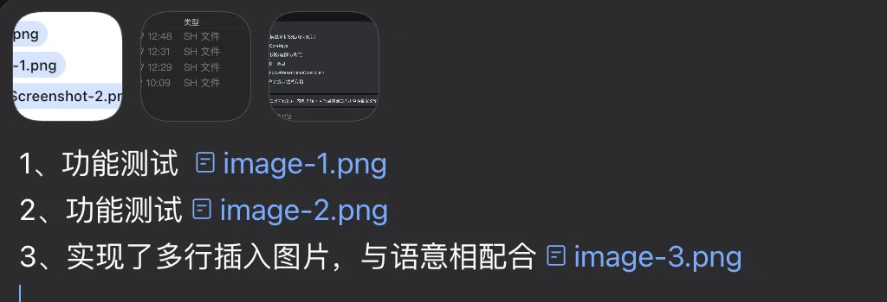
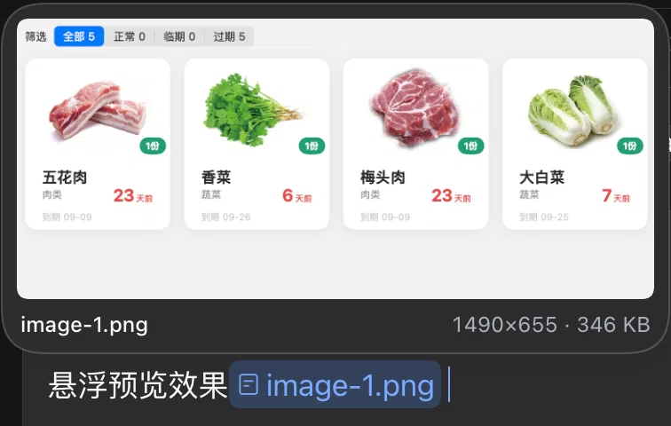

# dsh-inline-pastes

[](https://github.com/qgynisc/dsh-inline-pastes/actions/workflows/test.yml)
[](https://github.com/qgynisc/dsh-inline-pastes/blob/main/LICENSE)
[](https://github.com/qgynisc/dsh-inline-pastes/releases)

给 DeepSeek Harness Web GUI 加三件事（对齐 WorkBuddy 的「文字中插图」）：

1. **文字中插图** —— 粘贴图片时，在**光标处**插入一个内联胶囊 `[图标] image-1.png`，图片本身仍按官方管线作为附件随本条消息一起发出（模型照样收到图）。
2. **悬浮预览** —— 鼠标停在**这个名字上**（输入框里的内联胶囊、已发送气泡里的同名文字）弹出缩略图预览卡，带尺寸与体积；移开即收，Esc 也收。
3. **自动编号** —— 名字自动编排：`image-1.png`、`image-2.png` ……，按媒体大类分前缀、扩展名跟真实 MIME 走，为 mp3 / pdf 等未来类型预留。

## 安装

**方式一：克隆到本地，用仓库里的脚本（本机实测过）**

```bash
git clone git@github.com:qgynisc/dsh-inline-pastes.git
cd dsh-inline-pastes
npm run build                # 可选：lib/ 已随仓库入库，构建产物就是加载器要的那份
npm run install:desktop      # 装进 desktop profile（自动备份 package.json / pnpm-lock.yaml）
# 别的 profile：node scripts/install.mjs --profile web
```

装完**重启 DeepSeek Harness**（客户端插件要重新加载 bundle 才会生效）。

**方式二：用 DSH 自带的插件安装命令**

```bash
dsh plugin --profile desktop add git@github.com:qgynisc/dsh-inline-pastes.git
```

**卸载**：`npm run uninstall:desktop`，或直接删掉 profile 里 `dsh.profile.bundles` 的
`dsh-inline-pastes` 一行与 `dependencies` 里的对应条目。

**验证装好了没**：重启后浏览器控制台里 `__dshInlinePastes.version` 应等于插件版本号。

## 实际效果

**① 文字中插图** —— 粘贴图片，胶囊落在光标处，图片照常作为附件随消息一起发出：



<sub>（截图上方那块深色浮层是 macOS 的文件提示，与本插件无关。）</sub>

**② 悬浮预览** —— 鼠标停在胶囊里的名字上，弹出预览卡（缩略图 + 名字 + 尺寸 · 体积），移开即收：



---

```
1、功能1  [🖼 image-1.png]
2、功能2  [🖼 image-2.png]
3、修改bug如图：[🖼 image-3.png]，把它变成可自动定位。
```

---

## 多张图片时，名字和图片怎么对应（不会乱）

**模型侧是「贴名字」，不是「靠数顺序」。** DSH 给模型发图时，会在**每张图前面紧挨着**插一行文字
（`@deepseek-ai/dsh-llm` 的 `requestImageHandleText`，DeepSeek / pi-ai 两个适配器都走它）：

```
Image "image-1.png" (sha256:abc…); request preview 1972x397px. …
<图片本体>
Image "image-2.png" (sha256:def…); request preview 1200x800px. …
<图片本体>
```

所以模型看文字里的 `image-1.png` 时，同一条消息里那张图头上就写着同一个名字，一一对应；
即使中间混进拖拽/`+` 按钮加进来的图片（它们用自己的原文件名，同样带 handle 行），也不会串。

**界面侧**：DSH 把一条消息的所有图片排在气泡**上方**的附件行里，文字在气泡里 —— 所以人眼看到的是
「上面一排缩略图 + 下面文字里的名字」，靠名字对齐（缩略图本身不显示名字，只有 hover 的无障碍标签）。

**本插件的三条保证**：

1. 同一条消息内：**粘贴顺序 = 编号顺序 = 附件顺序**（一次粘多张也按剪贴板顺序）；
2. 把胶囊从文字里删掉、但 dock 缩略图还留着时，**编号不会重开**（否则一条消息会出现两个 `image-1`）；
3. 只有发送之后（草稿与附件都清空）才从 `image-1` 重新开始。

**两个仍然要注意的**：

- 发送前从 dock 里**删掉中间某张缩略图**、文字里的胶囊却没删，这条消息的编号就会与图片个数错开一格。
  要么删缩略图时把胶囊一起删，要么发送前扫一眼；
- 编号按消息重开（这是你要的），所以**不同消息里会出现同名**的 `image-1.png`。同一条消息内不会歧义
  （handle 行贴着图），但如果跨消息引用，名字不唯一。想要全会话唯一，把 `CONFIG.counterScope` 改回 `'session'`。

## 命名规则

| 粘贴内容 | 生成的名字 |
| --- | --- |
| PNG 截图 | `image-1.png`、`image-2.png` … |
| WebP / JPEG / GIF | `image-1.webp` / `image-1.jpg` / `image-1.gif` |
| MP3 / WAV | `audio-1.mp3` / `audio-1.wav` |
| MP4 / MOV | `video-1.mp4` |
| PDF | `pdf-1.pdf` |
| docx / xlsx / pptx | `doc-1.docx` |
| txt / md / json | `text-1.md` |
| zip / tar / 7z | `zip-1.zip` |
| 其他 | `file-1.<真实扩展名>` |

- 序号**按前缀分别计数**（`image-1` 与 `audio-1` 各数各的）。
- **每条消息都从 `image-1.png` 重新开始**；同一条消息里连续粘则接着排（`image-1` → `image-2` → `image-3`）。
  判据是「当前草稿里还没有本插件的胶囊」，所以**先打字再插图**（草稿非空）同样算新消息；发送后草稿清空，下一条消息自然又从 1 开始。
- 想改成「整个会话连续排」：把 `src/client.js` 里 `CONFIG.counterScope` 设成 `'session'` 再 `npm run build`。
- 计数**持久化在 localStorage**（按会话 id 分键，只留最近 100 个会话）：刷新页面/重启应用后，**同一条还没发送的消息**接着往下排，不会把 `image-1.png` 又发一遍。
- v1 只接管**图片**粘贴（`image/png|jpeg|webp|gif`）。音频/文档的命名能力已就位，接的时候只需在 `handlePaste` 的入口放行对应 MIME 即可。

## 配置

全部集中在 `src/client.js` 顶部的 `CONFIG`（改完 `npm run build` 即可）：

| 键 | 默认 | 说明 |
| --- | --- | --- |
| `enabled` | `true` | 总开关 |
| `interceptPaste` | `true` | 关掉就退回官方行为（图片只进附件轨） |
| `startIndex` | `1` | 序号起点 |
| `hoverDelayMs` | `140` | 悬浮多久弹预览 |
| `prefixes` | 见上表 | 各媒体大类的前缀 |
| `maxRemembered` | `600` | 预览记忆上限（超出淘汰最早的并释放 object URL） |
| `showMeta` | `true` | 预览卡是否显示「宽×高 · 体积」 |
| `auditBeforeSend` | `true` | 发送前自检：名字与图片对不上时在输入框上方提示 |
| `blockOnAuditFailure` | `true` | 自检不通过时第一次回车拦一下（再按一次放行）；`false` = 只提示不拦 |
| `badgeThumbnails` | `true` | 给 dock / 已发送气泡的缩略图加序号角标 |
| `badgeScanMinIntervalMs` | `80` | 角标重扫的最小间隔（流式输出时 MutationObserver 很吵，节流用） |

## 胶囊必须注册 codec（v0.3.1 修的真实 bug）

官方在**发送时**不是读节点上缓存的文本，而是按「胶囊 source → codec」重新序列化一次：
`ui-conversation` 的 `sinkSerialized` 对每个引用调 `inputTriggers.serializeReference(source, ref)`，
owner 缺失或没有 `codec` 就直接 reject，草稿被弹回并报

```
slash: no serializer for reference source "inline-paste"
```

所以本插件用 `ctx.inputTriggers.registerSource({ trigger, name: 'inline-paste', codec })` 注册了一个
**只带 codec 的 source**：触发符用不可输入的 `\u0000inline-paste`（核心的触发器检测写死只认 `@` 和 `/`，
所以它永远不会出现在任何菜单里），`codec.serialize(ref)` 把隐藏 ref（`dsh-inline-paste:<文件名>`）还原成文件名。
拿不到 `inputTriggers` 时，插件**退回纯文本插入**：宁可少个胶囊，也不能让发送被拦。

## 缩略图上的序号角标

`dock` 的附件轨和**已发送气泡里的图片行**，每张缩略图左下角都会显示一个序号小圆点
（`image-3.png` → `3`），悬浮缩略图还能看到全名（原生 `title`）。开着大图看的时候也能一眼知道
「这张是第几张」。

**序号是"读"出来的，不是数出来的**：官方两处的缩略图 `alt` 填的都是文件名
（dock 是 `attachment.file.name`，气泡里是持久附件 ref 的 `name` —— 也就是发给模型时那行
`Image "image-1.png" …` 的来源），所以即使你删过其中某张图、顺序变了，角标也不会错位。

**实现方式与代价（唯一一处 DOM 注入）**：官方的 `conversation.input.attachments` 声明是
`kind: "single"`，`slots.register` 遇到第二个注册会直接抛错；想接管就得把它顶掉、自己重写整条
附件轨（缩略图 / 删除 / 拖拽 / 大图 / 上传进度），不值得。所以这里是把角标节点挂进缩略图的
`<button>` 内侧（`overflow:hidden` 之内、左下角避开右上角的删除 `×`），配合
`MutationObserver` **自愈**：React 重渲染把它冲掉后会自动再挂一次。

这是本插件唯一一处往 React 管理的 DOM 里塞节点。失效的表现只是**角标消失**，不影响粘贴、
胶囊、发送、预览；一键关掉：`CONFIG.badgeThumbnails = false`。

## 发送前自检（保险）

**什么时候提示**：本条消息的草稿里，出现下面两种「对不上」时，输入框上方会挂一条提示
（走官方 composer 的 notice 位，`shell.notify('info', …)`，不往 React 管的 DOM 里塞节点）：

- 文字里点了名、但本条消息里**没有这张图**（比如你把 dock 里的缩略图删了、文字里的胶囊还在）
  → `图片名自检：image-1.png 在本条消息里找不到对应图片（再按一次回车仍可发送）`
- 同一个名字在本条消息里**出现两次**

**拦住的分寸**：自检不通过时，**第一次回车会被拦下**（提示已经挂在输入框上方），
**再按一次回车照常发送** —— 这是保险，不是门禁，绝不静默改你的内容，也不会把你卡死。
自检通过、Shift+Enter 换行、输入法组合中、Alt/AltGraph、不在输入框里 —— 一律不碰。

**查什么、不查什么**：只查「文字里提到的名字是否真有那张图、且不重复」。官方给模型发图时会把名字贴在图上
（见上一节），所以「有图但文字没点名」不算错，图照样带着名字发出去，不报。

要关掉：`CONFIG.auditBeforeSend = false`（连提示一起关），或 `CONFIG.blockOnAuditFailure = false`（只提示不拦）。

## 粘接管边界（这是本插件最看重的纪律）

只在**全部**满足时才接管，否则一律原样交还官方 `intakeFiles`：

- 事件发生在 composer 内（认 `[data-input-scroll]` 标记）；
- 剪贴板里的文件**全是**官方支持的图片类型（混进一个 pdf 就整批放行）；
- 已有打开且保留的会话（`uiSession.current`）；
- 输入框处于 `plain` / `claimed` 相位（提交中、裁决中不动）；
- 没超出会话的 `imageLimits`（超了就交给官方弹它自己的提示）。

接管后任何一步失败（哪怕一个胶囊都没插进去）都会**释放草稿并 return false**，绝不 `preventDefault`。
上一代同类插件（`@qithird/dsh-paste-input-plus`）就是无脑在 window 捕获阶段拦 paste，又因为
DSH 0.2.0-rc.2 起 `sessions.list` 快照没有 `current` 字段而读不到会话，结果既没插成胶囊、
又把官方图片粘贴整个堵死。本插件因此：

- 当前会话只从 `uiSession.current.getSnapshot()` 取（老快照字段只作兜底）；
- `handlePaste` 全程 try/catch，拦截器捕获异常后**不拦事件**。

## 目录结构

```
src/host.js       宿主半边（占位：只为让 dsh-client-modules 能按包名找到 client bundle）
src/client.js     浏览器半边（命名规划 / 粘贴接管 / 胶囊插入 / 悬浮预览，单文件 CJS 模块体）
src/styles.css    预览卡样式（构建时注入 client bundle）
scripts/build.mjs         包装成 window.__ModuleLoader__.load({ id, factory }) 产物
scripts/verify-browser.mjs 真 Chrome 端到端验证（静态服务器 + harness 回执）
scripts/install.mjs       装进 / 卸出某个 DSH profile（自动备份 package.json / pnpm-lock.yaml）
tests/unit/*.test.mjs     单测（直接测构建产物本身）
tests/harness/*           浏览器 harness（假 ctx + 真 ClipboardEvent / elementFromPoint）
```

## 开发

```bash
npm run build          # → lib/index.js、lib/client.js
npm test               # 构建 + 单元测试 + 真 Chrome 端到端（需要本机有 Chrome）
npm run test:ci        # CI 跑的同一条：构建 + 单测 + 用临时 profile 做加载器解析链自检
npm run verify:browser # 只跑浏览器层（需要本机 Chrome；可用 --chrome <path> 指定）
node scripts/verify-install.mjs --simulate   # 干净机器/CI 上没有真 profile 时，临时造一个再自检
npm run install:desktop   # 装进 desktop profile（当前桌面端用的就是它）
npm run uninstall:desktop # 卸出
```

构建产物形态与官方 client 包一致（`window.__ModuleLoader__.load({ id, factory })`），
**id 必须等于 package.json 的 name**，否则 dsh-client-modules 会报 "loaded without registering"。

## 名字会重复出现，预览怎么不串台（v0.3 起）

编号按消息重开之后，同一个会话里会出现多条消息都叫 `image-1.png`。悬浮预览因此**优先到「那条消息自己的附件行」里按序号取图**（`[data-chat-node-key]` → `[data-message-attachments] img` 的第 N 张），而不是查全局名字表：

- 每条消息都预览自己那张图，不会串到最新那条消息；
- 顺带把「刷新页面后历史消息没有预览」这个 v1 限制也解决了大半——用的是会话授权的持久图片地址，只要那张图已经在气泡里渲染出来就能预览。

只有输入框草稿里的名字（还没发送、没有消息 DOM 可依）才回退到本插件的内存登记表。

## 持续集成

`.github/workflows/test.yml` 在每次 push / PR 跑 **Ubuntu × Node 20/22/24** 三档，执行
`npm run test:ci`（构建 → 单测 → 临时 profile 的加载器解析链自检）。

它专门盯两类**本机抓不到**的问题：

- **跨平台**：macOS 文件系统大小写不敏感、Ubuntu 敏感 —— 导入路径大小写写错只有 Linux 会炸；
- **跨 Node 版本**：`package.json` 声明 `engines >= 20`，而开发机只在 Node 26 上跑过。

（它抓不到「DSH 升级改坏了官方契约」—— 单测用的是假 ctx，不是真 DSH；这类只能实测。）

## 已知限制

- 如果某条消息里的图片**被手动删过**（附件序号不连续），「按序号取第 N 张」会偏；此时输入框里的胶囊仍然准确（走登记表）。
- 气泡里的图片还在加载中（缩略图转圈）时，那一条的悬浮预览不会弹。
- 点击胶囊目前没有动作（`appearance: 'file'` 会让光标变手型，但不会打开大图查看器）。官方 `conversation.message.images` 是**单占用 slot**，抢过来会顶掉原生图片渲染，所以没有走那条路。
- 胶囊里的图标沿用官方 `appearance: 'file'` 的文件图标；想换成图片图标可以用 CSS 覆盖
  `[data-composer-chip='inline-paste'] svg`（见 `src/styles.css`）。

## 调试钩子

插件在浏览器里暴露了一个只读诊断对象（浏览器控制台可用）：

```js
__dshInlinePastes.version              // 插件版本
__dshInlinePastes.useChips()           // 胶囊模式是否可用（false = 已退回纯文本插入）
__dshInlinePastes.auditNow()           // 立刻跑一次发送前自检，返回 {ok, duplicates, dangling, message}
__dshInlinePastes.debug.lastPaste      // 最近一次粘贴：{ sessionId, phase, files, inserted, names }
__dshInlinePastes.currentSession()     // 插件此刻认为的当前会话 id
__dshInlinePastes.remembered()         // 已记住多少张预览图
__dshInlinePastes.has('image-1.png')   // 某个名字能不能预览
__dshInlinePastes.forgetSession(id)    // 清掉某会话的计数（下次从 image-1 重开）
```

判断「编号是不是真的按消息重开」：粘一张（`names: ['image-1.png']`）→ 再粘一张（`['image-2.png']`）
→ 发送 → 再粘一张（又回到 `['image-1.png']`）。

## 排错

- 插件没生效：先在设置里确认行 `inline-pastes` 已加载；再看浏览器控制台有没有
  `[dsh-inline-pastes] ...` 的告警（插件任何一步失败都会打在这里，并且不会拦你的粘贴）。
- 粘贴后没有胶囊：把 `CONFIG.interceptPaste` 临时设成 `false` 对比一次——如果关掉后官方行为正常，
  说明是接管条件没过（多半是没打开会话，或剪贴板里混了非图片文件）。
- 预览卡不出现：悬浮要停在**名字本体**上（胶囊或文字），且该名字必须是本次页面生命周期内粘贴的。
